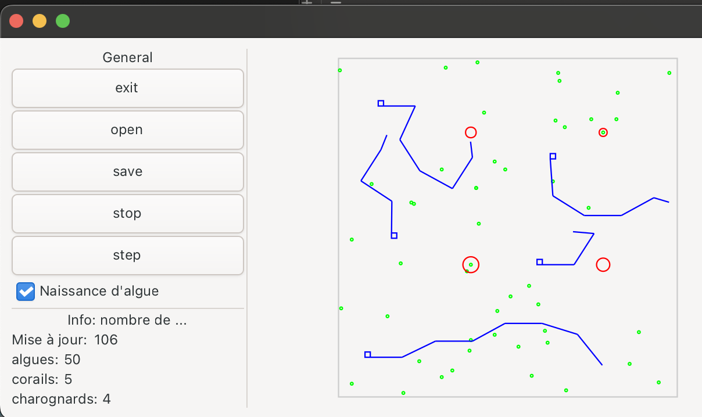

# MicroReef — Algae / Coral / Scavenger Simulation (C++17 + GTKmm 4)


A small **2D ecosystem simulation** ("drop of water") with three lifeforms — **algae**, **corals**, and **scavengers** — rendered in real time through a **GTKmm 4 GUI**.

The original assignment is in French: [`docs/00_Instructions.pdf`](docs/00_Instructions.pdf).

---

## Recruiter Quickstart (60 seconds)

1) **Install dependencies** (pick your OS section below)

2) **Build**
```bash
make
```

3) **Run (GUI)**
```bash
./projet tests/inputs/t27.txt
```

4) **Run the full test sweep (headless, no GUI)**
```bash
make test
```

---

## What you'll see



- Green dots = algae, blue polylines = corals, red circles = scavengers.
- Left panel: controls (open / save / step / run / stop) and live entity counts.

---

## Architecture

| Layer | Files | Role |
|-------|-------|------|
| **Model** | `simulation.{h,cc}`, `lifeform.{h,cc}` | Simulation loop, entity logic |
| **View** | `gui.{h,cc}`, `graphic.{h,cc}` | GTKmm 4 window, Cairo 2D rendering |
| **Geometry** | `shape.{h,cc}` | Segment intersection, collision detection |
| **Entry point** | `projet.cc` | CLI arg parsing, app bootstrap |

Key design choices:
- **Polymorphism** — `Lifeform` base class with `Algue`, `Corail`, `Scavenger` derived classes
- **Ownership** — `std::unique_ptr<Corail>` for safe memory management, no manual `delete`
- **Headless mode** — env var `MICRORECIF_HEADLESS=1` skips the GUI for CI and batch runs

---

## Tests (52 / 52 passing)

The repository provides a **headless mode** so batch execution doesn't open a GTK window:

```bash
make test
# or
./scripts/run_all_tests.sh
```

Output:
```
[OK]   t00.txt
[OK]   t01.txt
...
[OK]   t46.txt

Summary: 52 test files
  OK/WARN: 52
  WARN (non-zero): 0
  FAIL (crash/signal): 0
```

You can also run a single input in headless mode:
```bash
scripts/run.sh tests/inputs/t27.txt
```

Logs are stored under `tmp/` (ignored by git). More details: [`tests/README.md`](tests/README.md).

> If scripts are not executable after cloning: `chmod +x scripts/*.sh`

---

## Repository layout

```text
.
├── src/                  # C++ sources
├── include/              # C++ headers
├── tests/inputs/         # Input test files (t*.txt)
├── docs/                 # Assignment PDF + design notes
├── scripts/              # Helper scripts (run, batch tests)
└── .github/workflows/    # CI (Ubuntu)
```

---

## Requirements

- A C++17 compiler (`g++` or `clang++`)
- `make`
- `pkg-config`
- **GTKmm 4.0** development package (provides `gtkmm-4.0` for `pkg-config`)

Sanity check once installed:
```bash
pkg-config --modversion gtkmm-4.0
```

---

## Install dependencies

### macOS (Homebrew)

1) Install Homebrew (if needed):
```bash
brew --version
```
If `brew` is missing, install it from the Homebrew website.

2) Install dependencies:
```bash
brew update
brew install pkg-config make gcc gtkmm4
```

3) Verify GTKmm is visible:
```bash
pkg-config --modversion gtkmm-4.0
```

> **Note (macOS)**: if `make` behaves oddly, try Homebrew's `gmake`:
```bash
gmake clean && gmake
```

### Linux (Ubuntu/Debian)

```bash
sudo apt-get update
sudo apt-get install -y g++ make pkg-config libgtkmm-4.0-dev
```

Verify:
```bash
pkg-config --modversion gtkmm-4.0
```

> Other distros: install the equivalent GTKmm 4 development package + `pkg-config`.

### Windows

GTKmm 4 on native Windows can be painful to set up reliably. The recommended path is:

#### Option A (recommended): WSL2 + Ubuntu
1) Install **WSL2** and the **Ubuntu** distribution.
2) In the Ubuntu terminal, run the Linux install commands above.
3) Build and run from WSL.

> GUI note: for a GTK GUI under WSL, you'll need an X server (Windows 10) or WSLg (Windows 11). If you only want to validate inputs, `make test` runs in headless mode.

#### Option B (advanced): MSYS2
Possible, but toolchain/package names change often. Prefer WSL2 unless you already know MSYS2 + GTKmm.

---

## Build

From the repository root:
```bash
make
```

Output:
- `./projet` (executable)

Useful targets:
```bash
make help
make clean
```

---

## Run (GUI)

Run with a sample input file:
```bash
./projet tests/inputs/t27.txt
```

Or:
```bash
make run
# Optionally:
make run TEST=tests/inputs/t00.txt
```

Behavior:
- If a filename is provided, it initializes the simulation from that file.
- If no filename is provided, the GUI starts and you can open a file from the interface.

---

<details>
<summary><strong>Troubleshooting</strong></summary>

### `Error: gtkmm-4.0 not found via pkg-config`
- macOS: `brew install pkg-config gtkmm4`
- Ubuntu/Debian: `sudo apt-get install -y pkg-config libgtkmm-4.0-dev`

Then verify:
```bash
pkg-config --modversion gtkmm-4.0
```

### `pkg-config: command not found`
Install it:
- macOS: `brew install pkg-config`
- Ubuntu/Debian: `sudo apt-get install -y pkg-config`

### `./projet: No such file or directory`
- Ensure you built successfully: `make`
- Ensure you are at the repository root (where the `Makefile` is)

### macOS: `ld: library not found` / runtime library issues
Homebrew libraries may require your terminal to see Homebrew's paths. Try:
```bash
brew doctor
```
Then open a new terminal and rebuild.

</details>

---

## License

No explicit open-source license was provided with the original project.
This repository is published as **All Rights Reserved** by default (see `LICENSE`).

---

## Author

- **Alice Lemaire**
